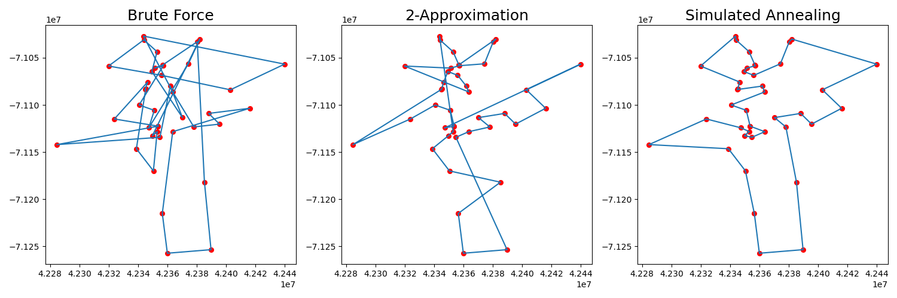
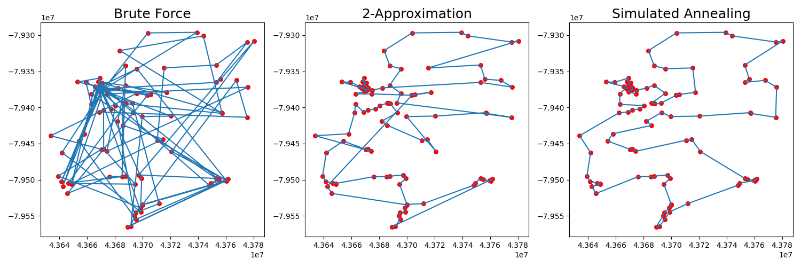

# Traveling Salesman Problem Solvers
This library, developed for a class project, can be used to solve the traveling salesman problem (TSP). We have implemented three ways:

- First, brute force, which can find the global minimum for which the problem quickly becomes intractable.
- Second, a fast approximation with provable guarantees using Prim's algorithm.
- Third, simulated annealing, which has no provable guarantees but can often find a great estimate if well implemented.

Results, tested on well-known TSP, show that our simulated annealing approach consistently gives the best tours at a low cost.

